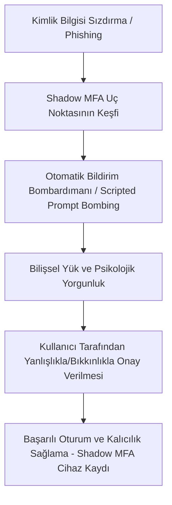

# Analysis Lab Case Study: SHADOW MFA FATIGUE
**UUID**: `9c474094-75b7-4e15-87de-051379b328c9`
**Type**: `ANALYSIS-LAB`

## Mission Objective
Conduct in-depth research and analysis for this configuration/incident. 

### Instructions
1. Provide a technical summary of the issue or configuration directive.
2. Outline the attack vector or risk if misconfigured.
3. Provide a step-by-step hardening or remediation guide.
4. Include any relevant scripts, configurations (e.g. `docker-compose.yml`, `nginx.conf`), or commands used.

---

### 1. Technical Summary (Teknik Özet)

#### Shadow MFA Fatigue Kavramı ve Mimari Analizi
"Shadow MFA Fatigue" (Gölge MFA Yorgunluğu), siber saldırganların bir organizasyonun ana (birincil) kimlik doğrulama sistemlerinin dışında kalan, izlenmeyen, denetlenmeyen veya unutulmuş eski kimlik doğrulama uç noktalarını (legacy authentication endpoints) hedef alarak gerçekleştirdikleri gelişmiş bir sosyal mühendislik ve hizmet dışı bırakma (MFA prompt bombing) saldırı türüdür. 

Kurumlar genellikle ana kimlik doğrulama mekanizmalarını (örn. Entra ID, Okta) modern güvenlik standartlarına yükseltirken, arka planda çalışan ve "Shadow IT" (Gölge BT) olarak adlandırılan bazı eski altyapıları (eski VPN sunucuları, RADIUS ağ geçitleri, test ortamları veya eski OAuth API uç noktaları) güncellemeyi unuturlar veya iş sürekliliği gerekçesiyle açık bırakırlar. Saldırganlar, ele geçirdikleri kullanıcı kimlik bilgileriyle bu korumasız gölge uç noktalara yönelerek kullanıcının mobil cihazına sürekli push bildirimleri gönderir ve kullanıcıyı onay vermeye zorlar.

#### Standart MFA Fatigue ile Shadow MFA Fatigue Arasındaki Farklar

| Karşılaştırma Boyutu | Standart Push MFA Fatigue | Shadow MFA Fatigue |
| :--- | :--- | :--- |
| **Hedef Protokol / Yapı** | OIDC, SAML 2.0, modern Web API'leri. | PAP, CHAP, MS-CHAPv2 (RADIUS üzerinden), eski REST API endpointleri. |
| **Güvenlik Sıkılaştırma Düzeyi** | Sayısal Eşleştirme (Number Matching) zorunludur. Kullanıcı ekranda gördüğü kodu girmek zorundadır. | Yalnızca "Onayla" veya "Reddet" seçeneği sunan basit push bildirimleri kullanılır; sayısal eşleştirme mimari olarak imkansızdır veya kapalıdır. |
| **Görünürlük ve Loglama** | Merkezi SIEM ve IAM (Identity and Access Management) panellerinde detaylı telemetri üretilir. | Loglar genellikle lokal sunucularda (Syslog, NPS logs) kalır, korelasyonu zordur ve görünürlük dışındadır. |
| **Saldırı Yüzeyi** | Doğrudan kurumsal ana giriş sayfası. | Kurumun test/staging portalları, eski VPN ağ geçitleri, iş ortakları için açık bırakılan eski API rotaları. |

---

### 2. Attack Vector and Risk Analysis (Saldırı Vektörü ve Risk Analizi)

#### Saldırı Yaşam Döngüsü (Pipeline)



1. **Kimlik Bilgisi Sızdırma (Credential Harvesting):** Saldırgan, Password Spraying, credential stuffing veya oltalama (phishing) yöntemleriyle hedef kullanıcının birincil parolasını ele geçirir.
2. **Gölge Uç Nokta Keşfi (Shadow Endpoint Reconnaissance):** Saldırgan, pasif ve aktif bilgi toplama yöntemleriyle kuruma ait olan ve çok faktörlü doğrulamaya sahip ancak sayısal eşleştirme barındırmayan legacy servisleri (örn. `vpn.sirket.com`, `/api/legacy/auth`) haritalandırır.
3. **Otomatik Bombardıman (Scripted Push Bombing):** Saldırgan, otomasyon araçları kullanarak legacy API'ye veya RADIUS sunucusuna saniyede birkaç kez istek göndererek kullanıcının mobil uygulamasına arka arkaya push bildirimi gitmesini sağlar.
4. **Bilişsel Yük ve Psikolojik Manipülasyon:** Kullanıcı, telefonunun kesintisiz titremesi, gece geç saatte gelen bildirimler veya iş saatlerindeki yoğunluk nedeniyle zihinsel olarak yorulur. Bildirimleri susturmak veya hatayı gidermek amacıyla "Onayla" (Approve) butonuna tıklar.
5. **Kalıcılık Sağlama (Post-Exploitation Persistence):** Erişim elde eden saldırgan, hemen kullanıcı portalına giderek kendi kontrolündeki "Gölge" bir MFA cihazını (FIDO2 Token veya authenticator uygulaması) kullanıcı hesabına ikincil doğrulama yöntemi olarak kaydeder. Bu andan itibaren kullanıcının ana parolası değiştirilse bile saldırgan bypass mekanizmasına sahip olur.

#### Operasyonel Risk Analizi ve Hız Sınırlama (Rate-Limiting) Eksikliği
Çoğu eski kimlik doğrulama sunucusunda (özellikle RADIUS protokolü tabanlı sistemlerde) istek sıklığını kontrol eden bir hız sınırlama (rate-limiting) mekanizması bulunmaz. Bu durum, tek bir IP adresinden veya tek bir kullanıcı hesabı için sınırsız sayıda MFA push tetiklenmesine olanak tanır. İnsan faktörünün sınırları (bilişsel yüklenme) ile birleştiğinde, bu teknik zafiyet kurumsal ağların en kritik giriş noktalarının (VPN, VDI, RDP) kolayca aşılmasına yol açar.

---

### 3. Forensic Analysis & Log Evidence (Dijital Adli Bilişim ve Log Kanıtları)

Bir Shadow MFA Fatigue saldırısı sonrasında, DFIR (Dijital Adli Bilişim ve Olay Müdahale) ekipleri aşağıdaki log kaynaklarında anomaliler aramalıdır.

#### A) Legacy API Erişim Günlükleri (NGINX/IIS Logs)
Saldırganın otomatik script kullandığını gösteren, saniyeler içinde gerçekleşmiş yüksek frekanslı POST istekleri:
```json
{"timestamp": "2026-05-22T22:40:01Z", "client_ip": "198.51.100.45", "request": "POST /api/v1/auth/mfa/trigger", "status": 200, "user_agent": "Python-urllib/3.10"}
{"timestamp": "2026-05-22T22:40:03Z", "client_ip": "198.51.100.45", "request": "POST /api/v1/auth/mfa/trigger", "status": 200, "user_agent": "Python-urllib/3.10"}
{"timestamp": "2026-05-22T22:40:05Z", "client_ip": "198.51.100.45", "request": "POST /api/v1/auth/mfa/trigger", "status": 200, "user_agent": "Python-urllib/3.10"}
{"timestamp": "2026-05-22T22:40:07Z", "client_ip": "198.51.100.45", "request": "POST /api/v1/auth/mfa/trigger", "status": 200, "user_agent": "Python-urllib/3.10"}
{"timestamp": "2026-05-22T22:40:09Z", "client_ip": "198.51.100.45", "request": "POST /api/v1/auth/mfa/trigger", "status": 200, "user_agent": "Python-urllib/3.10"}
{"timestamp": "2026-05-22T22:40:32Z", "client_ip": "198.51.100.45", "request": "POST /api/v1/auth/mfa/verify", "status": 200, "user_agent": "Python-urllib/3.10"}
```
*   **Analiz:** 30 saniye içinde 5 kez tetiklenen push isteğinin ardından gelen ilk `verify` isteğinin başarılı olması, kullanıcının en sonunda pes ederek onayladığını doğrular.

#### B) RADIUS / NPS Sunucusu Günlükleri (Windows NPS Event Log - ID 6272)
RADIUS sunucusu üzerinde ardışık "Access-Request" paketlerinin ardından gelen başarılı bağlantı:
```text
Event Type:        Auditing Success
Event Source:      Microsoft-Windows-NetworkPolicyServer
Event ID:          6272
Description:
Network Policy Server granted access to a user.
User:
    Security ID:                  S-1-5-21-36238192-3712903
    Account Name:                 mehmet.aksoy
Client:
    Friendly Name:                Legacy-VPN-Gateway
    IP Address:                   192.168.10.5
NAS:
    Port Type:                    Virtual
    Friendly Name:                VPN-Gateway
Authentication Details:
    Proxy Policy Name:            Secure-RADIUS-Proxy
    Network Policy Name:          MFA-Bypass-Legacy
    Authentication Scheme:        EAP-MSCHAPv2
```
*   **Analiz:** NPS olay günlüğündeki `Network Policy Name` alanında "MFA-Bypass-Legacy" gibi istisnai veya eski kuralların tetiklendiği görülür.

---

### 4. MITRE ATT&CK Matrix Mapping (MITRE ATT&CK Matris Eşleştirmesi)

| Taktik | Teknik ID | Teknik Adı | Açıklama |
| :--- | :--- | :--- | :--- |
| **Erişim Sağlama (Credential Access)** | T1621 | Multi-Factor Authentication Request Generation | |
| **İlk Erişim (Initial Access)** | T1078 | Valid Accounts | Ele geçirilen meşru hesap bilgileri ile sisteme sızılması. |
| **Savunmayı Atlatma (Defense Evasion)** | T1556.006 | Modify Authentication Process: MFA | Sisteme sızıldıktan sonra saldırganın kendi cihazını "Gölge MFA" olarak kaydetmesi. |
| **Kalıcılık (Persistence)** | T1098 | Account Manipulation | Kullanıcı profiline yetkisiz MFA cihazlarının ve token'ların eklenmesi. |

---

### 5. Step-by-Step Hardening and Remediation Guide (Adım Adım Sıkılaştırma ve Çözüm Rehberi)

#### Adım 1: Sayısal Eşleştirme (Number Matching) Yapılandırması
*   **Aksiyon:** Tüm push tabanlı MFA sağlayıcılarında (Microsoft Authenticator, Okta Verify, Duo) sayısal eşleştirmeyi zorunlu hale getirin.
*   **Uygulama:** Kullanıcı oturum açmaya çalıştığında tarayıcıda/istemcide rastgele üretilen bir sayı (örn. 42) gösterilmeli ve kullanıcı bu sayıyı mobil uygulamasında doğrulamalıdır. Düz onay ("Approve") butonları tamamen devre dışı bırakılmalıdır.

#### Adım 2: Bağlam Tabanlı Uyarlanabilir Kimlik Doğrulama (Context-Aware Auth)
*   **Coğrafi Sınırlama (Geofencing):** Kurum çalışanlarının bulunmadığı ülkelerden veya şüpheli IP bloklarından gelen kimlik doğrulama isteklerini ağ seviyesinde veya IAM politikalarıyla engelleyin.
*   **IP Beyaz Listesi (IP Whitelisting):** Eski (legacy) kimlik doğrulama uç noktalarına erişimi yalnızca kurum VPN'i veya belirli güvenilir IP adresleriyle sınırlandırın.
*   **Cihaz Uyumluluk Kontrolleri (Device Compliance):** Kimlik doğrulama isteklerinin yalnızca MDM (Mobile Device Management) veya EDR (Endpoint Detection and Response) tarafından "Uyumlu" (Compliant) olarak işaretlenmiş, kurumsal sertifikaya sahip cihazlardan gelmesini zorunlu kılın.

#### Adım 3: MFA Tetikleyicilerine Katı Hız Sınırlaması (Rate-Limiting)
*   **Aksiyon:** MFA tetikleme uç noktalarına hem IP hem de kullanıcı hesabı bazlı kısıtlamalar getirin.
*   **Kural:** Aynı IP adresinden veya aynı kullanıcı hesabı için 1 dakika içinde en fazla 2 MFA push isteği gönderilebilmelidir. Sınır aşıldığında istekler 15 dakika boyunca bloklanmalı ve SOC ekibine alarm gönderilmelidir.

#### Adım 4: SIEM ve Log Analiz Alarmlarının Devreye Alınması
*   **Aksiyon:** SIEM (Splunk, Microsoft Sentinel vb.) üzerinde gerçek zamanlı korelasyon kuralları yazın.
*   **Kural Mantığı:** 
    `Eğer (MFA_Push_Request_Count > 5) ve (Time_Window <= 60sn) ve (MFA_Status == "Pending/Denied") ve (Son_İstek_Durumu == "Success") ise -> ALARM: Şüpheli MFA Fatigue Saldırısı.`

---

### 6. Relevant Scripts and Configurations (İlgili Scriptler ve Konfigürasyonlar)

#### A) NGINX Uç Noktası Hız Sınırlama Konfigürasyonu (`nginx.conf`)
`/api/v1/auth/mfa/trigger` uç noktasına yönelik brute-force ve MFA Fatigue saldırılarını engellemek amacıyla IP başına katı bir istek sınırlandırması uygulayan konfigürasyon dosyasına aşağıdaki bağlantıdan erişebilirsiniz:
*   [nginx.conf](file:///C:/Users/RFKaya/Desktop/ResearchLab/assignments/analysis-lab/2025-10-shadow-mfa-fatigue/nginx.conf)

#### B) Gerçek Zamanlı MFA Fatigue Tespit Scripti (Python)
Kimlik doğrulama loglarını (JSON formatında) analiz ederek kısa sürede çok sayıda reddedilmiş/bekleyen push isteğinin ardından gelen tek bir başarılı oturum açma işlemini (MFA Fatigue belirtisi) tespit eden script dosyasına aşağıdaki bağlantıdan erişebilirsiniz:
*   [mfa_fatigue_detector.py](file:///C:/Users/RFKaya/Desktop/ResearchLab/assignments/analysis-lab/2025-10-shadow-mfa-fatigue/mfa_fatigue_detector.py)

---

### 7. Lab Kurulumu ve Kullanımı (Simulation Lab)

Bu zafiyeti pratik olarak test edebilmek için oluşturulmuş bir Docker Compose laboratuvar ortamı bulunmaktadır. Bu ortamda; NGINX (ters vekil ve hız sınırlayıcı), Mock Auth API (zafiyetli legacy uç nokta) ve Tespit Scripti (mfa_fatigue_detector) eşzamanlı çalışır.

#### A) Laboratuvar Dosyaları
*   **[docker-compose.yml](file:///C:/Users/RFKaya/Desktop/ResearchLab/assignments/analysis-lab/2025-10-shadow-mfa-fatigue/docker-compose.yml)**: Tüm ortamı ayağa kaldıran orkestrasyon dosyası.
*   **[backend/mock_auth_api.py](file:///C:/Users/RFKaya/Desktop/ResearchLab/assignments/analysis-lab/2025-10-shadow-mfa-fatigue/backend/mock_auth_api.py)**: Sahte push isteklerini kabul eden ve loglayan arka uç servisi.
*   **[attack_simulator.py](file:///C:/Users/RFKaya/Desktop/ResearchLab/assignments/analysis-lab/2025-10-shadow-mfa-fatigue/attack_simulator.py)**: Asenkron (Python asyncio tabanlı) MFA Prompt Bombing saldırı simülatörü.

#### B) Laboratuvarı Çalıştırma Adımları

Laboratuvarı yerel sisteminizde Docker kullanarak veya Docker yüklü değilse doğrudan yerel Python süreçleri ile iki farklı şekilde çalıştırabilirsiniz:

##### Seçenek 1: Docker Compose ile Çalıştırma (Tavsiye Edilen)
Sisteminizde Docker Desktop kuruluysa:
1. **Docker Ortamını Başlatın**:
   ```bash
   docker compose up --build -d
   ```
2. **Sanal Ortamı Hazırlayın ve Bağımlılıkları Kurun**:
   ```powershell
   python3.13 -m venv .venv
   .\.venv\Scripts\python.exe -m pip install aiohttp
   ```
3. **Saldırıyı Simüle Edin** (Self-signed sertifika doğrulamasını atlamak için `--insecure-lab` parametresi eklenmiştir):
   ```powershell
   .\.venv\Scripts\python.exe attack_simulator.py --requests 20 --concurrency 5 --insecure-lab
   ```
4. **Tespitleri ve Logları İnceleyin**:
   ```bash
   docker logs mfa_fatigue_detector
   ```

---

##### Seçenek 2: Docker Olmadan Yerel (Local) Çalıştırma
Sisteminizde Docker yüklü değilse, laboratuvarı doğrudan yerel terminal pencerelerinizde çalıştırabilirsiniz:

1. **Bağımlılıkları Kurun**:
   ```powershell
   python3.13 -m venv .venv
   .\.venv\Scripts\python.exe -m pip install aiohttp Flask
   ```
2. **Birinci Terminalde: Mock API Backend Servisini Başlatın**:
   API'nin düzgün çalışması ve log yazabilmesi için log dizininin var olduğundan emin olun (Windows PowerShell üzerinde):
   ```powershell
   # Log klasörünü oluşturun
   New-Item -ItemType Directory -Force -Path "C:\var\log"
   
   # Mock API backend'i çalıştırın
   .\.venv\Scripts\python.exe backend/mock_auth_api.py
   ```
   *(Bu terminal backend isteklerini dinlemeye başlayacaktır)*

3. **İkinci Terminalde: Dedektörü (Detector) Başlatın**:
   Başka bir PowerShell penceresi açıp proje dizinine gidin ve log dosyasını izleyecek tespit aracını çalıştırın:
   ```powershell
   .\.venv\Scripts\python.exe mfa_fatigue_detector.py
   ```

4. **Üçüncü Terminalde: Saldırıyı (Simulator) Tetikleyin**:
   Üçüncü bir PowerShell penceresinden saldırıyı simüle edin:
   ```powershell
   .\.venv\Scripts\python.exe attack_simulator.py --url http://127.0.0.1:8080/api/v1/auth/mfa/trigger --requests 20 --concurrency 5
   ```

   *Not: Docker olmadan çalışırken doğrudan `http://127.0.0.1:8080` adresine (NGINX proxy katmanı olmadan) istek gönderdiğimiz için hız sınırlaması uygulanmaz; ancak Dedektör, log dosyasını izleyerek saldırıyı anında yakalayacak ve terminalinize uyarı alarmı basacaktır.*

---

Bu senaryo sonucunda, hız sınırlaması (NGINX rate-limiting) aktif edilmediği takdirde `attack_simulator.py` yüzlerce push isteğini saniyeler içinde arka uca iletecek, ardından sahte bir "verify success" sinyali ile başarılı bir MFA Fatigue saldırısını taklit edecektir. Tespit scripti ise loglara düşen bu paterni anında algılayıp ekrana uyarı basacaktır.

---

### 8. SIEM Entegrasyonu (Sigma Kuralı)

Güvenlik Operasyon Merkezi (SOC) ekiplerinin bu zafiyeti SIEM ürünlerinde (Sentinel, Splunk, QRadar vs.) tespit edebilmesi için standartlaştırılmış bir Sigma kuralı oluşturulmuştur.

*   **[sigma_rule.yml](file:///C:/Users/RFKaya/Desktop/ResearchLab/assignments/analysis-lab/2025-10-shadow-mfa-fatigue/sigma_rule.yml)**

Kural, kısa süre (1 dakika) içerisinde 5'ten fazla "pending" veya "denied" push olayı loglandıktan sonra hemen ardından gelen bir "success" olayını yakalamak üzerine kurgulanmıştır.
